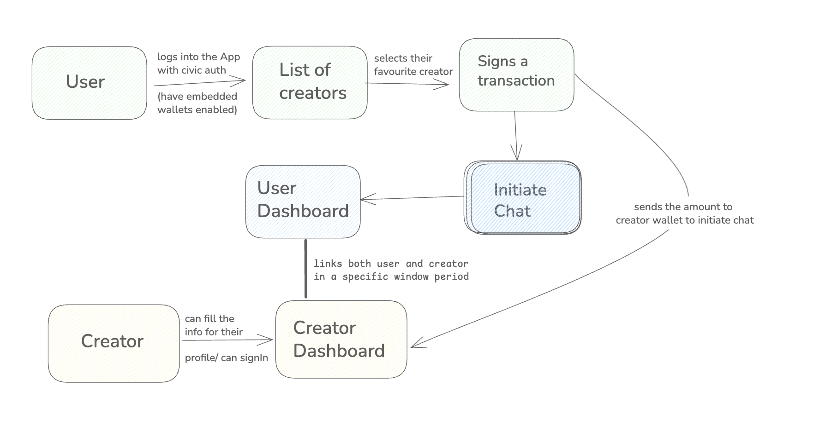

# Intouch - Connect with Your Favorite Creators


Intouch is a platform that bridges the gap between creators and their audience through direct messaging and secure payments. Built with modern web technologies, Intouch provides a seamless experience for users to connect with their favorite content creators.

## 🌟 Features

- **Direct Messaging**: Real-time chat between creators and their audience
- **Secure Payments**: Embedded Civic Web3 Wallet (Solana) for seamless transactions
- **Creator Profiles**: Beautiful, customizable profiles for content creators
- **Priority Messaging**: Pay for priority access to your favorite creators
- **Transaction History**: Keep track of all your interactions and payments


## Architecture Diagram




## 🏗️ Tech Stack

- **Frontend**: React 19, TypeScript, Vite
- **UI/UX**: Tailwind CSS, Framer Motion
- **Authentication**: Civic Web3
- **Blockchain**: Embedded Civic Web3 Wallet (Solana)
- **Database**: Supabase (PostgreSQL)
- **Routing**: React Router
- **Form Handling**: React Hook Form
- **Notifications**: React Hot Toast

## 🚀 Getting Started

### Prerequisites

- Node.js (v18 or later)
- npm or yarn
- Solana CLI (optional, for development)

### Installation

1. Clone the repository:
   ```bash
   git clone https://github.com/your-username/intouch.git
   cd intouch
   ```

2. Install dependencies:
   ```bash
   npm install
   # or
   yarn
   ```

3. Create a `.env` file in the root directory and add your environment variables:
   ```env
   VITE_SUPABASE_URL=your_supabase_url
   VITE_SUPABASE_ANON_KEY=your_supabase_anon_key
   VITE_CIVIC_CLIENT_ID=your_civic_client_id
   ```

4. Start the development server:
   ```bash
   npm run dev
   # or
   yarn dev
   ```

5. Open [http://localhost:5173](http://localhost:5173) in your browser.

## 🏗️ Project Structure

```
src/
├── components/           # Reusable UI components
│   ├── creator/         # Creator-specific components
│   └── user/            # User-facing components
├── hooks/               # Custom React hooks
├── store/               # State management
├── utils/               # Utility functions
├── App.tsx              # Main application component
└── main.tsx             # Application entry point
```


## 🤝 Contributing

Contributions are welcome! Please follow these steps:

1. Fork the repository
2. Create your feature branch (`git checkout -b feature/AmazingFeature`)
3. Commit your changes (`git commit -m 'Add some AmazingFeature'`)
4. Push to the branch (`git push origin feature/AmazingFeature`)
5. Open a Pull Request

## 📄 License

This project is licensed under the MIT License - see the [LICENSE](LICENSE) file for details.

## 🙏 Acknowledgments

- [Vite](https://vitejs.dev/) for the amazing build tooling
- [Tailwind CSS](https://tailwindcss.com/) for utility-first CSS
- [Civic Web3](https://civic.com/) for the wallet integration
- [Solana](https://solana.com/) for the blockchain infrastructure
- [Supabase](https://supabase.com/) for the backend services


We're still in the building phase, so some features might not work as expected or may cause a little trouble—thanks for bearing with us! 😊
